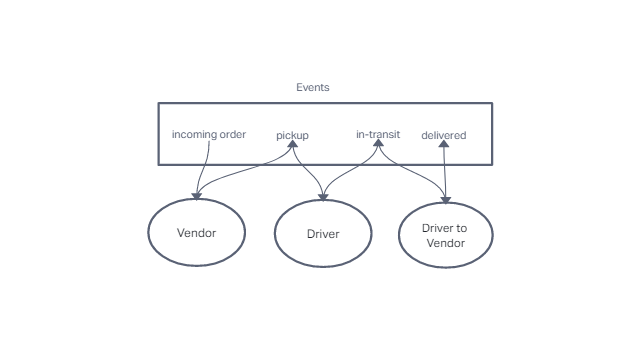

# Code Academy Parcel Service (CAPS)

A service that allows vendors to alert in real time to a our Parcel Services that a package is ready to be delivered and also allows our drivers to give status updates to the vendors.

## UML

## Installation

- Clone from this repo `git clone https://github.com/bradyjcamp/caps.git`
- Run `npm install`

## Usage

Once installed, run `npm start`.

## Contributors / Authors

- Brady Camp

## Features / Routes

No routes currently.
